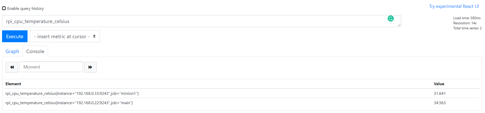

# Montar cluster de kubernetes en una raspberry (kubeberry)

## ¿Qué necesitamos??

- X raspberry
- X tarjetas de memoria (yo recomiendo como poco 32 Gb)
- X cables de alimentación para las raspberry

## Instalación de sistema operativo

Vamos a usar ubuntu server de 64 bits porque ahora mismo no esta disponible raspbian de 64 bits.
Instalamos la imagen en la tarjeta con "Raspberry pi imagier" y luego desde la tarjeta sd podemos configurar las redes (wifi) y la conexión por ssh 

Para configurar el wifi desde la sd podemos modificar el fichero `network-config` como podemos ver en esta guía
 https://ubuntu.com/tutorials/how-to-install-ubuntu-on-your-raspberry-pi#3-wifi-or-ethernet
 
 ```
 wifis:
  wlan0:
    dhcp4: no
    addresses: [192.168.0.22/24]
    gateway4: 192.168.0.1
    nameservers:
      addresses: [192.168.0.163, 8.8.8.8]
    optional: true
    access-points:
      "<wifi network name>":
        password: "<wifi password>"

```

En principio el sistema anterior funciona sin problemas pero para que vaya todo bien hay que reiniciar la raspberry. En el boot inicial se conecta configura la red pero para que los cambios
hagan efecto hay que reiniciar. Si estas conectado por pantalla puedes hacer un `sudo reboot`. Yo como la tenía sin pantalla simplemente le he quitado la alimentación 
a los 5 minutos aprox. Luego la he vuelto a encender y aunque tarda parece que ha ido todo correctamente

### Activar memory groups 

Esto también se puede hacer desde la SD antes de arrancar.


Para que k3s funcione es necesario activar unos parámetros en el fichero de startup.

Para ver que fichero tenemos que modificar podemos verlo en: `cat /boot/firmware/config.txt`

Vemos la línea: `cmdline=cmdline.txt`

Modificamos el fichero y añadimos los parámetros de memoria.

`boot/firmware/cmdline.txt`

net.ifnames=0 dwc_otg.lpm_enable=0 console=serial0,115200 console=tty1 root=LABEL=writable rootfstype=ext4 elevator=deadline rootwait fixrtc **cgroup_enable=cpuset cgroup_enable=memory cgroup_memory=1**

### Cambiar contraseña y actualizar SO

La primera vez que nos conectamos nos va a pedir que cambiemos la contraseña. La contraseña por defecto es "ubuntu" y tras realizar el cambio lo ideal es hacer un `sudo apt-get upgrade` para instalar todas las 
actualizaciones disponibles.

## Instalación software de monitorización

Aunque esto no es obligatorio, vamos a instalar un software de monitorización para ver como van de cargas las distintas raspberrys y poder consultarlo con un panel de grafana.
Para hacer todo esto más fácil vamos a usar **Ansible**, que es un software que nos permite lanzar una serie de comandos que configuremos en todos los dispositivos. 

Yo la verdad que no tengo mucha idea de Ansible así que basicamente he buscado por internet y copia un poco el script con las cosas que me hacen falta. Me he guiado sobre todo 
de esta web: https://www.dinofizzotti.com/blog/2020-04-10-raspberry-pi-cluster-part-1-provisioning-with-ansible-and-temperature-monitoring-using-prometheus-and-grafana/#static-ips


### Instalar ansible

Para guiarme un poco con los primeros pasos he usado esta guía: https://blog.deiser.com/es/primeros-pasos-con-ansible

Basicamente instalamos Ansible, en mi caso lo voy a instalar en ubuntu. Este software los vamos a instalar desde la máquina en la que vamos a ejecutar los comandos. No en las raspberries

```
sudo apt-get install software-properties-common
sudo apt-add-repository ppa:ansible/ansible
sudo apt-get update
sudo apt-get install ansible
```

### Copiar cable ssh a los nodos

Copiamos la cable ssh a las raspberries para que ansible se pueda conectar sin necesidad de contraseña por ssh. Para ello ejecutamos el siguiente comando para cada nodo:

```
ssh-copy-id user@192.168.0.XXX
```

Si no tenemos clave generada, la podemos generar antes con el comando `ssh-keygen`. 

### Creamos el fichero de inventario de Ansinble

Ansible puede usar un fichero de inventario donde listamos todos los nodos que vamos a usar. Este fichero es `inventory.yml` dento de la carpeta ansinble. Tiene el siguiente formato. 

```
---
all:
  hosts:
    main:
      ansible_host: 192.168.0.22
    minion1:
      ansible_host: 192.168.0.33
  children:
    raspberry_pi:
      hosts:
        main: {}
        minion1: {}
    monitoring_server:
      hosts:
        main: {}
  vars:
    ansible_python_interpreter: /usr/bin/python3
    remote_user: ubuntu
```

En este fichero definimos los distintos nodos con sus ips y grupos de hosts.

Finalmente para comprobar si todo se ha inicializado correctamente podemos lanzar el siguiente comando:

```
ansible all -m ping -u ubuntu -i inventory.yml
```

Si todo ha ido bien obtendremos esta respuesta:

```
minion1 | SUCCESS => {
    "changed": false,
    "ping": "pong"
}
main | SUCCESS => {
    "changed": false,
    "ping": "pong"
}
```

### Instalar software monitorización

Para instalar el software en ambdos nodos podemos usar el palybook que está creado en la carpeta ansible. Esta copiado casi todo de la guía del primer enlace añadiendo algunas modificaciones. Basicamente tenemos una tarea llamada `up.yml` que va a intentar consolidar los roles en definidiso en los distintos nodos.

El comando es el siguiente:

```
ansible-playbook up.yml -i inventory.yml
```

Después de instalar el software es posible acceder al panel de Prometheus para consultar los datos que se están generando con las métricas de los nodos. Esto es posible gracias también al `rpi exporter`.

Si accedemos al dashboard de `http://192.168.0.22:9090/graph` podemos ver distintas métricas como la temperatura de la CPU (rpi_cpu_temperature_celsius).



Con los datos que exporta Prometheus podemos generar un dashboard en grafana para consultar las estadísticas. Para crear el dashboard tenemos que añadir el data source de grafana y podemos hacer un dashboard a partir del json del fichero `grafana-dashboard.json`;

## Instalando k3s

Para la instalación de kubernetes vamos a usar k3s que es una distribución hecha por Rancher Labs que es muy ligera y diseñada para dispositivos que no tienen mucha potencia. Para la instalación vamos a usar `k3sup`, una herramienta que permite realizar la instalación muy fácilmente.

### Antes de instalar

Vamos a repasar algunos de los componentes que tiene un cluster y para que sirven. k3s nos incluye algunos de estos componentes ya por defecto pero otros vamos a instalarlos a parte.

#### Load Balancer
Es el componente encargador de resolver los servicios de tipo Load Balancer. En resumen, se encarga de resolver la IP a través de la que el nodo se va a comunicar con estos servicios. 

En AKS tenemos un componente que lo que hace es que crea un recurso de tipo IP fija y asocia la dirección IP a este servicio.

En nuestro caso vamos a usar el servicio que viene por defecto en k3s que lo que hace es publicar la IP del nodo. ESte servivicio es [Klipper lb](https://github.com/k3s-io/klipper-lb)

#### Ingress controller
El ingress controller es el servicio que se encarga de procesar los recursos de tipo `ingress`, que en resumen son reglas de enrutamiento para el cluster.

Por defecto k3s viene con Traefik como ingress controller pero nosotros no lo vamos a instalar y vamos a usar el nginx ingress controller.

#### Cert manager
Otro de los servicios que puede tener un cluster es un cert-manager. Este servicio se encarga de la emisión automática de certificados LTS para que podamos tener conexiones seguras. Nosotros vamos a usar el cert-manager de lets encrypt que nos va a generar certificados gratis de forma automática. Para esto vamos a tener que resolver otros problemas pero lo veremos más adelante.

#### Storage provider
Cuando queremos tener persistencia de disco duro tenemos que tener un storage provider. k3s viene por defecto con `local-path` que se encarga de mapear un directorio local con un `persistent volume claim`. 

Se puede configurar para mapear el path que queremos que se use pero hay que tener en cuenta que si tenemos diversos nodos se nos complica la cosa ya que los datos puedes estar en un nodo u otro. 

Para sincronizar el storage entre nodos se puede usar otros providers como `longhorn`, pero yo no lo he usado. En mi caso me da un poco igual poque las aplicaciones que uso no usan storage.

### Instalación
Para realizar la instalación debemos de añadir k3s al nodo principal y luego añadir el resto de nodos como minions del nodo principal.

Para la instalación del nodo master lanzamos el siguiente comando (vamos a deshabilitar la instalación de traefik porque luego instalaremos el nginx ingress controller)

```
k3sup install --ip 192.168.0.22 --user ubuntu --k3s-extra-args '--no-deploy traefik'
```

Despues de la instalación se genera un fichero `kubeconfig` en el que tenemos los datos para acceder al cluster a través de kubectl. Existe varias formas para usar este fichero desde kubectl como añadir el fichero a la variable de entorno `KUBECONFIG` o usando una herramienta específica para esto como [konfig](https://github.com/corneliusweig/konfig). También podemos poner la configuración dentro del fichero de config situado en `$HOME/.kube/config`. 

Si perdemos el fichero también lo podemos sacar del nodo main en `/etc/rancher/k3s/k3s.yaml`.

Para unir los otros nodos debemos de lanzar el siguiente comando para cada uno de ellos.

```
k3sup join --ip 192.168.0.33 --server-ip 192.168.0.22 --user ubuntu --k3s-extra-args '--node-name minion1'
```

Es importante que todos los nodos no tengan el mismo nombre para no tener errores en el startup
